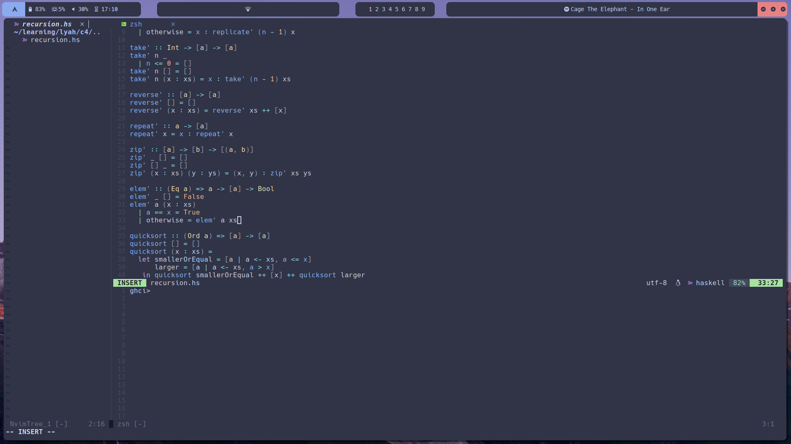
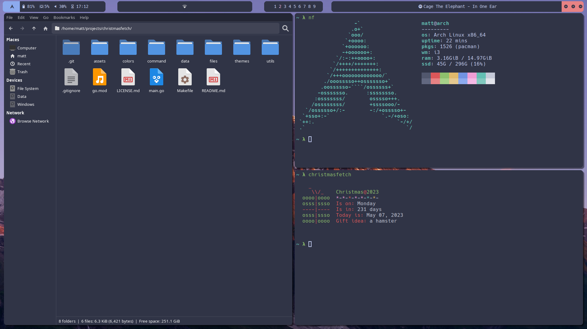
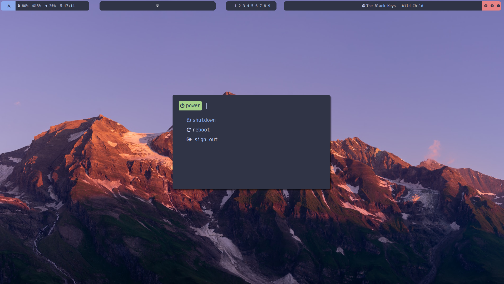
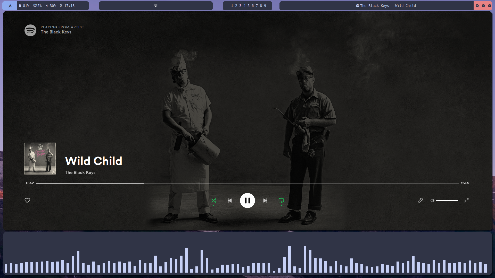

# My Dotfiles :)

## Programs
- **Distro:** Arch Linux
- **WM:** i3
- **Terminal Emulator:** alacritty
- **Code Editor(s):** neovim & Visual Studio Code
- **Application Launcher:** Rofi
- **Notification Manager:** dunst
- **Bars:** Polybar
- **File Explorer:** Thunar
- **Fetch tools:** christmasfetch & neofetch
- **Audio Visualizer:** C.A.V.A.
- **Font:** Hack (Nerd Font Patched)

##  Screenshots
### Neovim 
### Rofi 
### Thunar 
### Power Menu 
### Music 